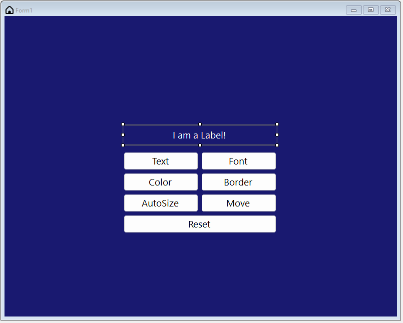

# Demo

Vytvořte zhruba stejné okno, jako je na obrázku

### Okno obsahuje:

- Label
- 7x Button

### Vlastnosti okna:

| Vlastnost       | Hodnota      |
|-----------------|--------------|
| Size            | 800;640      |
| FontSize        | 14pt         |
| BackgroundColor | MidnightBlue |

### Label

| Vlastnost   | Hodnota      |
|-------------|--------------|
| AutoSize    | False        |
| Size        | 305; 40      |
| BackColor   | MidnightBlue |
| ForeColor   | White        |
| BorderStyle | FixedStyle   |

### Buttons

- Vzhled a pozice tlačítek by měla jen zhruba odpovídat obrázku
- důležite jsou akce, které se provedou při kliknutí na tlačítko

#### Text

Změní text labelu na `ChangedText`

#### Font

1. Zvětší velikost fontu o 2

2. Maximální velikost fontu, kterou tlačítko zvládne nastavit, je 24.

3. Tlačítko se "vypne" a nelze s ním interagovat

#### Color

- Přepína mezi červenou a modrou barvou pozadí labelu.

#### AutoSize

- Přepína mezi vlastností AutoSize (`true`/`false`)

#### Move

- Změní pozici Labelu
    1. Na libovolnou pozici, kterou napíšete do kódu
    2. Posune label o `offset` pixelu nahoru při každém kliknutí - offset si zvolíte

#### Reset

Nastaví vlastnosti labelu na původní. ([zde](#Label))