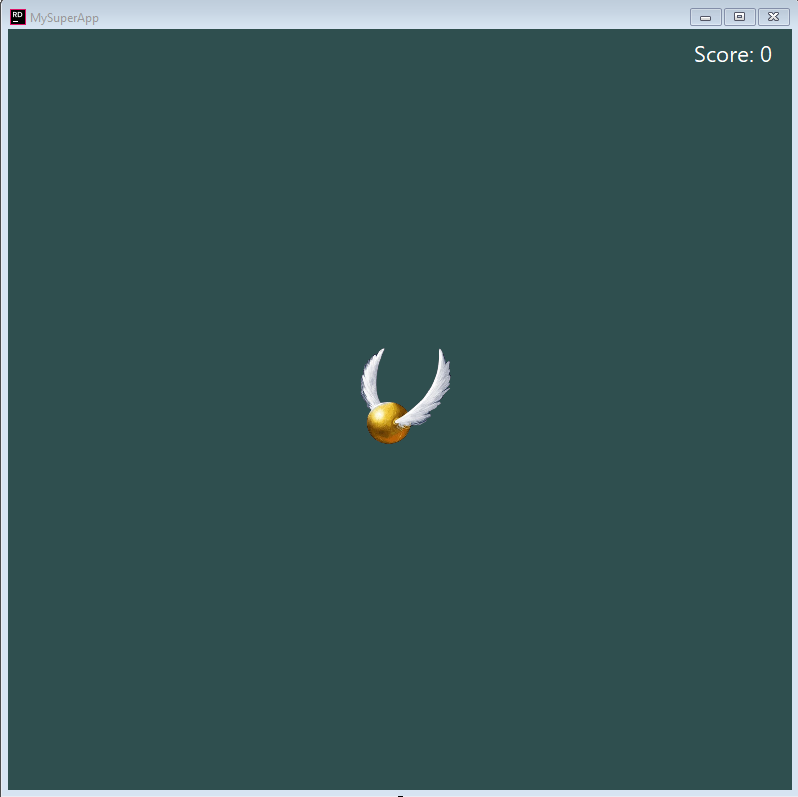
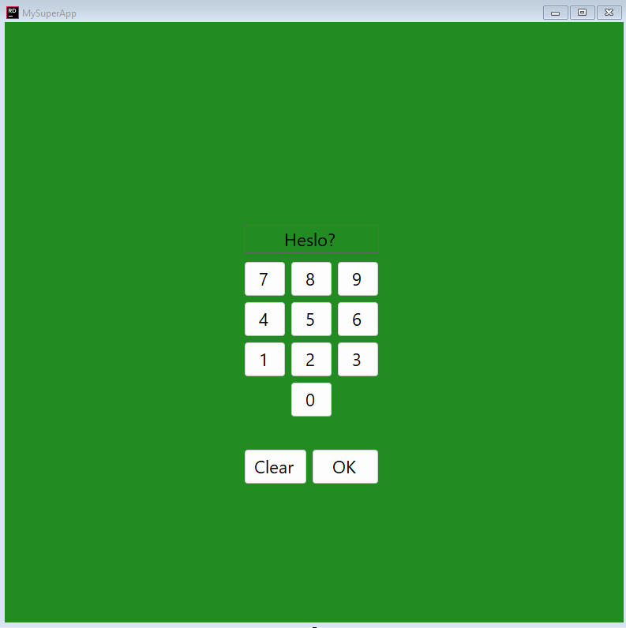

# Hry

## 1. Zlatonka

Okno:

### Cíl hry

Na herním poli se nachází zlatonka (ve skutečnosti tlačítko s obrázkem). 

Úkolem uživatele je zlatonku chytit 3x. (Chycení = kliknutí levého myšítka.)

Po 3 úspěšných kliknutí se uživateli vypíše zpráva **`Gratulujeme! Vyhráli jste`**

#### Obsah

- 1x Button -> Zlatonka
- 1x Label -> Skóre

##### Button

- Nastavte 
  - pozadí na `snitch.png`
  - velikost na `100; 100`
- Odeberte ohraničení
- Přidejte reakci na kliknutí
  - zvyší skóre o 1
  - Pokud je skóre 3, vypíše pomocí `MessageBox.Show("Text")` informaci o výhře a ukončí program
- Přidejte reakci na `MouseEnter`
  - Zlatonka změní svojí pozici na náhodnou pozici na okně
  - **Bonus**
    - ověřte, aby zlatonka vždy zůstala v okně
    - zajistěte, aby se zlatonka nikdy nevykreslila na stejné pozici, jako label

##### Label
- Text = `Score: 0`
- Skóre se aktualizuje s kliknutím tlačítka
- Připněte skóre k pravému hornímu rohu

## 2. Guess The Pin

### Cíl

Uhádnout 4-místní PIN

#### Obsah

- 10x `Button` Čísla 0-9
- 1x `Button` Clear - lze aktivovat klávesou ESC
- 1x `Button` Ok - lze aktivovat klávesou Enter/Mezerník
- 1x `Label` Heslo

##### Logika

- zmáčnkutí ciferníku přidá číslo na konec hesla
- OK je neaktivní
  - teprve až heslo obsahuje 4 číslice, tak je OK aktivní
  - validuje heslo a pomocí `MessageBox.Show("Text")` vypíše, zda uživatel uhodnul heslo, nebo ne
- Clear smaže heslo